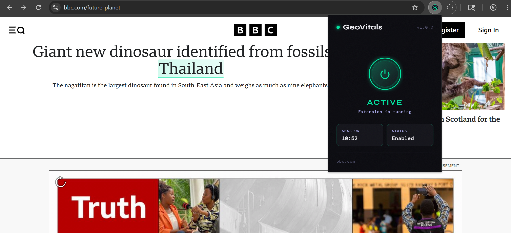
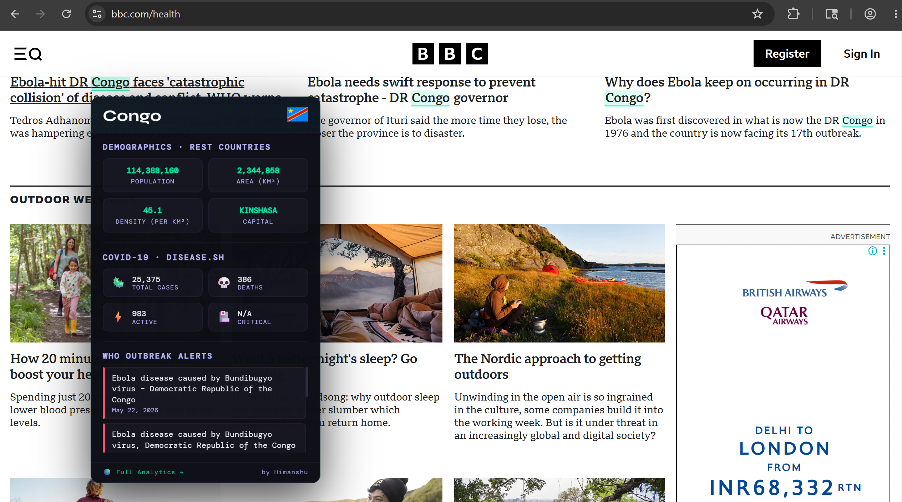
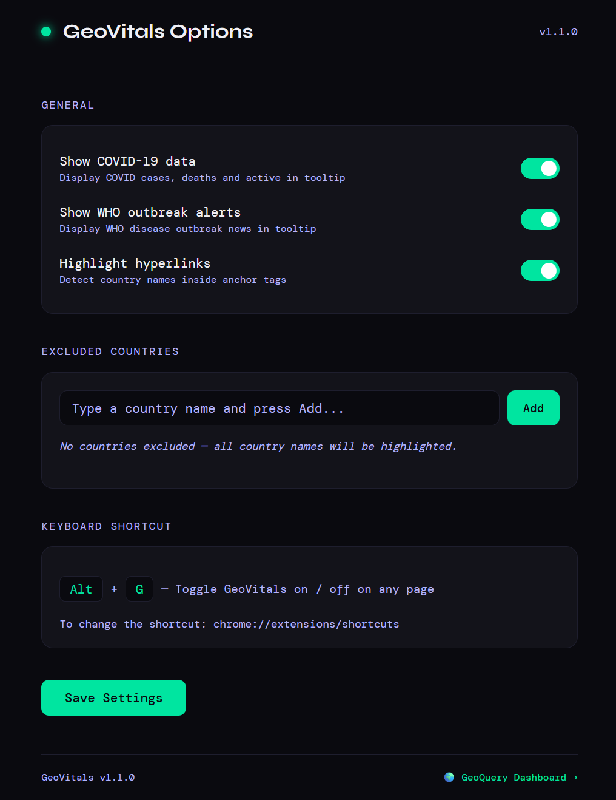

# 🌍 GeoVitals — Country Insights on Hover

> Hover over any country name on any webpage to instantly see demographics, visa requirements, live currency rates, COVID-19 statistics, WHO disease outbreak alerts, and latest news.

[](https://chromewebstore.google.com/detail/igkoiddcpkagiijomnmcadchopdnmlje)

---

## 🎬 Demo


## 📸 Screenshots

| Popup | Country Tooltip | Options |
|---|---|---|
|  |  |  |

---

## ✨ Features

- **Automatic country detection** — scans every webpage and highlights country names with a subtle green underline
- **Instant tooltip on hover** — population, density, area, capital city, visa requirement, live currency rate, COVID-19 stats, WHO alerts, and latest news
- **Visa checker** — shows visa requirement for your passport country on every hover; auto-detected from browser locale with option to change
- **Live currency rate** — shows 1 base → destination rate inline in the visa block, powered by daily exchange rate snapshots
- **News context mode** — 5 recent headlines per country via Google News RSS, localized to your passport country
- **Hyperlink support** — works on country names inside anchor tags too
- **Toggle on/off** — enable or disable from the popup or press `Alt+G`
- **Last hovered country** — popup shows your last viewed country with a direct link to full analytics
- **Options page** — auto-saves all settings instantly; show/hide visa, news, COVID data, WHO alerts; configure passport country and exclusion list
- **Session timer** — tracks how long the extension has been active
- **30-minute cache** — fast repeated lookups without redundant API calls
- **Works on any website** — news articles, Wikipedia, research papers, anything

---

## 🚀 Installation

### From Chrome Web Store *(recommended)*

[Available in the Chrome Web Store](https://chromewebstore.google.com/detail/igkoiddcpkagiijomnmcadchopdnmlje)

### From Source (Developer Mode)

```bash
# Clone
git clone https://github.com/Him97kr/chrome-extension-geovitals.git
cd chrome-extension-geovitals

# Install dependencies
npm install

# Build
npm run build

# Load in Chrome
# → chrome://extensions
# → Enable Developer Mode
# → Load unpacked → select dist/ folder
```

---

## ⌨️ Keyboard Shortcut

| Shortcut | Action |
|---|---|
| `Alt + G` | Toggle GeoVitals on / off |

To customise: `chrome://extensions/shortcuts`

---

## ⚙️ Options Page

Access via the **⚙ Options** link in the popup. All settings save automatically on change.

| Setting | Default | Description |
|---|---|---|
| Passport country | Auto-detected | Your passport country used for visa checks and news locale |
| Show Visa Requirements | ✅ On | Show visa status for your passport in tooltip |
| Show News Context | ✅ On | Show 5 recent headlines per country |
| Show COVID-19 data | ✅ On | Show total cases and deaths in tooltip |
| Show WHO outbreak alerts | ✅ On | Show WHO disease news in tooltip |
| Highlight hyperlinks | ✅ On | Detect country names inside anchor tags |
| Country exclusion list | Empty | Countries you never want highlighted |

---

## 🌐 Data Sources

All APIs are **free** and require **no API key**.

| API | Data |
|---|---|
| [REST Countries v5](https://restcountries.com) | Population, density, area, capital city, flag, ISO codes |
| [Passport Index](https://cdn.jsdelivr.net/gh/imorte/passport-index-data/passport-index.json) | Visa requirements by passport + destination country |
| [fawazahmed0 Currency API](https://cdn.jsdelivr.net/npm/@fawazahmed0/currency-api@latest/v1/) | Daily exchange rates for 150+ currencies, via jsdelivr CDN |
| [Google News RSS](https://news.google.com) | Recent headlines, localized to passport country |
| [disease.sh](https://disease.sh) | COVID-19 total cases and deaths |
| [WHO Outbreak News](https://www.who.int) | Disease outbreak alerts |

---

## 📁 Project Structure

```
chrome-extension-geovitals/
├── src/
│   ├── popup.js            # Vanilla JS popup
│   ├── popup.html          # Popup HTML template
│   ├── options.js          # Vanilla JS options page
│   ├── options.html        # Options HTML template
│   ├── background.js       # Service worker — API fetching & caching
│   ├── content.js          # Content script — highlights & tooltip
│   ├── manifest.json       # Chrome extension manifest v3
│   ├── 16.png              # Extension icons
│   ├── 32.png
│   ├── 48.png
│   └── 128.png
├── webpack.config.js
└── package.json
```

---

## 🏗️ How It Works

```
Page loads
  → Content script scans all text nodes via TreeWalker
  → Country names wrapped in highlight <span>

User hovers highlighted country
  → Loading tooltip shown immediately
  → Message sent to background service worker

Background worker
  → Fetches REST Countries + disease.sh + WHO + Passport Index + Currency API + Google News in parallel
  → Passport index + currency rates fetched once (30 min cache) from jsdelivr CDN
  → Google News RSS locale set from user's passport country (e.g. IN → hl=en-IN)
  → All results cached (30 min general, 5 min news)
  → Returns { demographics, visa, currency, news, covid, outbreaks }

Tooltip renders
  → Population, density, area, capital city
  → Visa requirement for your passport (Visa Free / On Arrival / eVisa / Required)
  → Live currency rate (1 base currency = X destination currency)
  → 5 recent news headlines
  → COVID-19 total cases and deaths
  → WHO outbreak alerts
  → Link to GeoQuery Dashboard for full analytics
```

---

## 🔒 Permissions

| Permission | Reason |
|---|---|
| `storage` | Save toggle state, settings and last viewed country |
| `tabs` | Show current tab hostname in popup; notify tabs on settings change |
| `activeTab` | Send messages to the active page |
| `host_permissions` | Fetch data from REST Countries, disease.sh, WHO, jsdelivr CDN, Google News |

---

## 🧱 Tech Stack

| Technology | Usage |
|---|---|
| Vanilla JS | Popup, options page, content script, background service worker |
| Webpack 5 | Bundler — keeps background/content scripts separate |
| Babel | Modern JS transpilation |
| Chrome Manifest V3 | Extension platform |

---

## 📦 Changelog

### v1.1.5
- ✅ Rest Countries API v5 compatibility

### v1.1.1
- ✅ Added **Visa Checker** — shows visa requirement (Visa Free / On Arrival / eVisa / Required) for your passport on every hover
- ✅ Added **News Context Mode** — 5 recent Google News headlines per country, locale-aware based on your passport country
- ✅ Passport country **auto-detected** from browser locale via `chrome.i18n.getAcceptLanguages()`
- ✅ Options page now **auto-saves** all settings instantly — no save button
- ✅ Added passport country selector + auto-detect button to options page
- ✅ Visa block redesigned as consistent grid matching the demographics layout
- ✅ COVID tooltip trimmed to total cases and deaths only (removed active/critical/emojis)
- ✅ Added **Currency Converter** — live 1 base → destination rate shown in visa block; same-currency detection; powered by fawazahmed0 API via jsdelivr CDN
- ✅ Google News RSS locale (`hl`, `gl`, `ceid`) dynamically set from passport country

### v1.1.0
- ✅ Fixed hover detection on country names inside hyperlinks
- ✅ Added **capital city** and **area** to tooltip demographics
- ✅ Added **last hovered country** in popup with direct GeoQuery link
- ✅ Added **Alt+G keyboard shortcut** to toggle extension
- ✅ Added **options page** — show/hide COVID, WHO, country exclusion list
- ✅ GeoQuery Dashboard link in tooltip and popup footer
- ✅ Flag rendered from REST Countries API image URL

### v1.0.0
- ✅ Initial release — country name detection, tooltip with population, COVID, WHO data

---

## 🔗 Related Projects

| Project | Description |
|---|---|
| [GeoQuery Dashboard](https://github.com/Him97kr/geoquery-dashboard) | Full country analytics dashboard — React + Redux + D3.js |
| [GeoQuery API](https://github.com/Him97kr/geoquery) | GraphQL API in Go powering the dashboard |
| [World Population Dashboard](https://github.com/Him97kr/world-population-dashboard) | D3.js population visualisation |

---

## 🤝 Contributing

1. Fork the repository
2. Create a feature branch: `git checkout -b feature/my-feature`
3. Commit: `git commit -m "add my feature"`
4. Push: `git push origin feature/my-feature`
5. Open a Pull Request

---

## 🙏 Acknowledgements

- [REST Countries](https://restcountries.com) for country data
- [Passport Index](https://github.com/imorte/passport-index-data) for visa requirement data
- [disease.sh](https://disease.sh) for COVID-19 statistics
- [World Health Organization](https://www.who.int) for outbreak news
- [fawazahmed0 Currency API](https://github.com/fawazahmed0/exchange-api) for daily exchange rates
- [Google News](https://news.google.com) for country news headlines

---

## 🛡️ Privacy Policy

- Link: [Privacy Policy](https://him97kr.github.io/chrome-extension-geovitals/privacy/)

---

## 👨‍💻 Author

**Himanshu**
- GitHub: [@Him97kr](https://github.com/Him97kr)
- LinkedIn: [Himanshu Kumar](https://in.linkedin.com/in/himanshu-kumar-518b71192)

---

## 📄 License

MIT License — see [LICENSE](LICENSE) for details.
